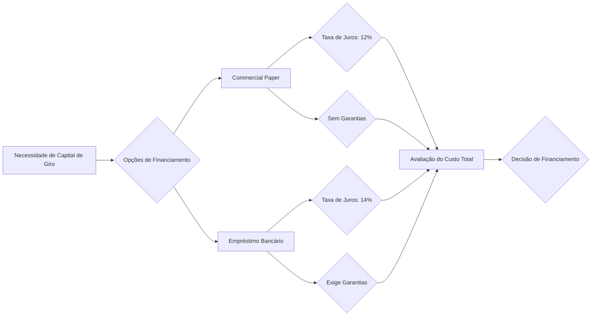

## Commercial Papers: Financiamento de Curto Prazo para Empresas Não Financeiras

### Introdução

Este capítulo aborda em detalhe os **Commercial Papers (CPs)**, títulos de dívida de curto prazo emitidos por sociedades anônimas não financeiras [^13]. Em continuidade ao estudo dos títulos de renda fixa e, particularmente, dos títulos emitidos por instituições não financeiras, como as debêntures [Anterior], exploraremos as características, formas de remuneração e aspectos tributários dos Commercial Papers. O foco será no seu papel como instrumento de captação de capital de giro e nas implicações para a gestão financeira das empresas [^13].

### Conceitos Fundamentais

**Commercial Papers (CPs)**, também conhecidos como *Notas Promissórias*, são títulos de dívida de curto prazo emitidos por empresas não financeiras com o objetivo de captar recursos para financiar o capital de giro [^11, ^13]. Eles representam uma alternativa ao crédito bancário tradicional, permitindo que as empresas diversifiquem suas fontes de financiamento e obtenham condições mais favoráveis [^13].

**Características Essenciais:**

*   **Emissor:** Sociedades anônimas não financeiras, tanto de capital aberto quanto fechado [^13].
*   **Objetivo:** Captação de recursos para capital de giro [^13].
*   **Prazo:** Curto prazo, geralmente inferior a um ano [^11].
*   **Registro:** Escriturais e registrados no Sistema de Notas Promissórias (Nota) da Cetip [^11, ^13].
*   **Forma de Remuneração:** Podem ser prefixados ou pós-fixados [^11, ^13].
*   **Base de Cálculo:** Ano-base de 360 dias corridos [^11, ^13].
*   **Tributação:** Imposto de Renda (IR) com alíquota decrescente conforme o prazo de aplicação [^11, ^13].

**Lema 1:** *A emissão de Commercial Papers permite à empresa obter recursos de forma mais ágil em comparação com a emissão de debêntures, devido ao menor prazo e menor complexidade do processo de emissão.*

**Prova:** A emissão de debêntures geralmente envolve um processo mais burocrático, incluindo a necessidade de aprovação em assembleia geral de acionistas e registro na CVM (se a oferta for pública). Os Commercial Papers, por serem de curto prazo e destinados ao capital de giro, possuem um processo de emissão mais simplificado, permitindo uma captação de recursos mais rápida.

**Formas de Remuneração:**

*   **Prefixados:** A taxa de juros é definida no momento da emissão, proporcionando previsibilidade ao investidor [^11, ^13].

    > 💡 **Exemplo Numérico:** Uma empresa do setor alimentício, necessitando de R\$ 500.000 para cobrir despesas sazonais, emite um CP prefixado com valor nominal de R\$ 1.000,00 por título, taxa de 10% ao ano e prazo de 180 dias. Um investidor que adquire 500 títulos (totalizando R\$ 500.000) receberá, no vencimento, o valor nominal dos títulos acrescido dos juros proporcionais ao período de 180 dias. O cálculo dos juros é feito com base no ano comercial de 360 dias.

$$Juros = ValorNominal \times Taxa \times \frac{Prazo}{360}$$

    Se o valor nominal for R\$1.000,00, os juros serão:

$$Juros = 1000 \times 0.10 \times \frac{180}{360} = R\$50,00$$

    O investidor receberá R\$ 50,00 de juros por título, totalizando R\$ 25.000,00 (500 títulos * R\$ 50,00). No vencimento, ele receberá R\$ 525.000,00 (R\$ 500.000,00 do valor nominal + R\$ 25.000,00 de juros brutos).

*   **Pós-fixados:** A remuneração é atrelada a um indexador, como a Taxa DI [^11].

    > 💡 **Exemplo Numérico:** Uma empresa do setor de tecnologia emite um Commercial Paper pós-fixado atrelado à Taxa DI + 1% ao ano, com prazo de 270 dias. Suponha que a Taxa DI média no período seja de 12% ao ano. O investidor receberá o valor nominal do título acrescido da variação da Taxa DI (12%) mais o spread de 1%, totalizando 13% ao ano.

    **Teorema 1:** *A escolha entre uma remuneração prefixada ou pós-fixada para um Commercial Paper depende da expectativa da empresa emissora em relação à trajetória futura das taxas de juros.*

    **Prova:** Se a empresa espera que as taxas de juros caiam no futuro, ela pode optar por emitir um CP prefixado com uma taxa mais alta, garantindo um custo de financiamento fixo e potencialmente mais vantajoso. Por outro lado, se a empresa espera que as taxas de juros subam, ela pode optar por emitir um CP pós-fixado, transferindo o risco de aumento das taxas para o investidor.

    **Corolário 1:** *Em cenários de alta volatilidade das taxas de juros, a emissão de CPs pós-fixados pode ser mais atrativa para as empresas, pois reduz a incerteza em relação ao custo final do financiamento.*

> 💡 **Exemplo Numérico:** Comparativo entre Prefixado e Pós-fixado. Suponha que uma empresa precisa de R\$1.000.000 para capital de giro por 180 dias. Ela considera duas opções:
>
> *   **Opção 1: Prefixado** - CP com taxa de 11% ao ano.
> *   **Opção 2: Pós-fixado** - CP atrelado à Taxa DI + 0.5% ao ano.
>
> Para analisar qual a melhor opção, a empresa precisa projetar a Taxa DI média para os próximos 180 dias. Suponha que a empresa projete uma Taxa DI média de 10% ao ano.
>
> **Cálculo do custo do CP Prefixado:**
>
> $$Custo_{Prefixado} = ValorNominal \times Taxa \times \frac{Prazo}{360}$$
> $$Custo_{Prefixado} = 1.000.000 \times 0.11 \times \frac{180}{360} = R\$55.000$$
>
> **Cálculo do custo do CP Pós-fixado:**
>
> $$Taxa_{Total} = TaxaDI + Spread = 0.10 + 0.005 = 0.105$$
> $$Custo_{PosFixado} = ValorNominal \times Taxa_{Total} \times \frac{Prazo}{360}$$
> $$Custo_{PosFixado} = 1.000.000 \times 0.105 \times \frac{180}{360} = R\$52.500$$
>
> Neste cenário, o CP Pós-fixado seria mais vantajoso, com um custo de R\$ 52.500 comparado ao custo de R\$ 55.000 do CP Prefixado. A escolha dependerá da acuracidade da projeção da Taxa DI e da tolerância ao risco da empresa. Se a Taxa DI média for superior a 10.5%, o CP Prefixado se tornará mais vantajoso.

**Tributação:**

Os ganhos obtidos com Commercial Papers são tributados pelo Imposto de Renda (IR) na fonte, com alíquotas decrescentes conforme o prazo de aplicação [^11, ^13]:

*   Até 180 dias: 22,5%
*   De 181 a 360 dias: 20%
*   De 361 a 720 dias: 17,5%
*   Acima de 720 dias: 15%

> 💡 **Exemplo Numérico:** Utilizando o exemplo do CP prefixado com juros de R\$50,00 por título e prazo de 180 dias, a alíquota de IR aplicável é de 22,5%. O IR retido na fonte será:

$$IR = Juros \times Aliquota = 50,00 \times 0.225 = R\$11,25$$

> O investidor receberá, portanto, R\$50,00 - R\$11,25 = R\$38,75 de juros líquidos por título. Para os 500 títulos, os juros líquidos totais serão de R\$ 19.375,00 (500 x R\$ 38,75), resultando em um valor total a receber de R\$ 519.375,00 (R\$ 500.000,00 + R\$ 19.375,00).

**Prova do cálculo dos juros líquidos:**

I. O valor dos juros brutos é dado por:
   $$Juros = R\$50,00$$

II. A alíquota do Imposto de Renda (IR) é de 22,5%, ou 0,225 em termos decimais. O valor do IR retido na fonte é calculado como:
    $$IR = Juros \times Aliquota = R\$50,00 \times 0,225 = R\$11,25$$

III. Os juros líquidos são calculados subtraindo o valor do IR dos juros brutos:
    $$JurosLiquidos = Juros - IR = R\$50,00 - R\$11,25 = R\$38,75$$

IV. Para os 500 títulos, os juros líquidos totais serão:
    $$JurosLiquidosTotais = 500 \times R\$38,75 = R\$19.375,00$$

V. O valor total a receber no vencimento é a soma do valor nominal dos títulos e dos juros líquidos totais:
   $$ValorTotal = R\$500.000,00 + R\$19.375,00 = R\$519.375,00$$

VI. Portanto, o investidor receberá R\$519.375,00 no vencimento. $\blacksquare$

**Resgate Antecipado e Venda:**

O emissor pode resgatar antecipadamente o CP, desde que o prazo mínimo de 30 dias seja cumprido [^13]. Além disso, os investidores podem vender os CPs antes do vencimento para outros agentes [^13]. *O emitente pode resgatar antecipadamente esse título (desde que o prazo mínimo de 30 dias seja cumprido) e, além disso, os investidores podem vender tais títulos antes do vencimento para outros agentes.* [^13].

**Lema 2:** *A possibilidade de resgate antecipado confere flexibilidade à empresa emissora, permitindo que ela reduza o custo do financiamento caso as taxas de juros caiam após a emissão do CP.*

**Prova:** Se a empresa emitir um CP prefixado e, posteriormente, as taxas de juros de mercado diminuírem, ela pode resgatar o CP e emitir um novo CP com uma taxa de juros mais baixa, reduzindo assim seu custo de financiamento.

> 💡 **Exemplo Numérico:** Uma empresa emite um CP prefixado com taxa de 12% ao ano e prazo de 180 dias. Após 60 dias, as taxas de juros de mercado caem para 10% ao ano. A empresa avalia se vale a pena resgatar o CP e emitir um novo.
>
> **Custo do CP original (180 dias):**
>
> Assumindo um valor nominal de R\$1.000.000:
> $$Juros_{Original} = 1.000.000 \times 0.12 \times \frac{180}{360} = R\$60.000$$
>
> **Custo proporcional do CP original até o resgate (60 dias):**
> $$Juros_{Proporcional} = 1.000.000 \times 0.12 \times \frac{60}{360} = R\$20.000$$
>
> **Custo do novo CP (120 dias restantes) com taxa de 10%:**
> $$Juros_{Novo} = 1.000.000 \times 0.10 \times \frac{120}{360} = R\$33.333,33$$
>
> **Custo total do financiamento com resgate:**
> $$Custo_{Total} = Juros_{Proporcional} + Juros_{Novo} = R\$20.000 + R\$33.333,33 = R\$53.333,33$$
>
> Neste caso, resgatar o CP original e emitir um novo CP com a taxa mais baixa resultaria em uma economia de R\$ 6.666,67 (R\$ 60.000 - R\$ 53.333,33). A empresa deve considerar os custos de transação para realizar o resgate e a nova emissão antes de tomar a decisão final.

**Commercial Papers vs. Debêntures:**

Embora ambos sejam títulos de dívida emitidos por empresas, os Commercial Papers se distinguem das debêntures principalmente pelo prazo e objetivo [Anterior, ^11, ^13]:

*   **Commercial Papers:** Curto prazo, capital de giro [^13].
*   **Debêntures:** Médio/longo prazo, financiamento de projetos e reestruturação de dívidas [Anterior].

**Vantagens e Desvantagens:**

*   **Para as Empresas:**

    *   Vantagens: Diversificação das fontes de financiamento, agilidade na captação de recursos [^13].
    *   Desvantagens: Custo potencialmente mais elevado do que outras formas de financiamento, dependendo das condições de mercado [^13].

*   **Para os Investidores:**

    *   Vantagens: Rentabilidade potencialmente superior à de outros títulos de renda fixa de curto prazo, liquidez [^13].
    *   Desvantagens: Risco de crédito da empresa emissora, volatilidade das taxas de juros [^13].

> 💡 **Exemplo Numérico:** Uma empresa avalia emitir CPs ou realizar um empréstimo bancário para financiar seu capital de giro. O CP tem uma taxa efetiva de 12% ao ano, enquanto o empréstimo bancário tem uma taxa de 14% ao ano. No entanto, o banco exige garantias, enquanto o CP não. A empresa pondera os prós e contras de cada opção, considerando o custo financeiro e a necessidade de oferecer garantias. Se a empresa tiver dificuldades em oferecer garantias, o CP pode ser a melhor opção, mesmo com uma taxa ligeiramente inferior ao empréstimo bancário.

**Gráfico Comparativo:**

### Conclusão

Os Commercial Papers representam uma importante ferramenta para o financiamento de curto prazo das empresas não financeiras no Brasil [^13]. A compreensão de suas características, formas de remuneração e aspectos tributários é fundamental para a tomada de decisões de investimento e gestão financeira.

### Referências

[^11]: 4.3. Títulos públicos – Características e formas de apreçamento
[^13]: 4.4 Títulos privados - Características
[^14]: S.A.: somente as companhias abertas, com registro na CVM, podem efetuar emissões públicas de debentures direcionadas ao público em geral. A emissão privada é voltada a um grupo restrito de investidores, não sendo necessário o registro na CVM.
<!-- END -->