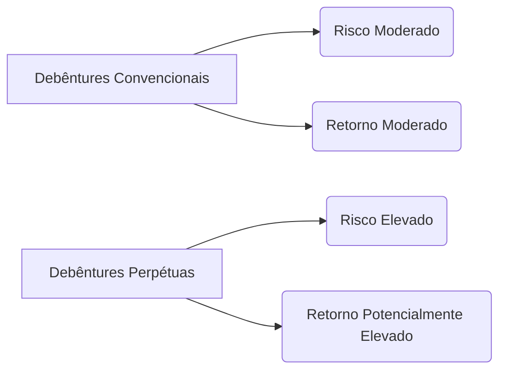

## Debêntures Perpétuas: Uma Análise Detalhada

### Introdução

Este capítulo se dedica ao estudo aprofundado das **debêntures perpétuas**, uma modalidade de títulos de dívida que, embora permitida por lei, não possuem data de vencimento predeterminada [^14]. Expandindo o conhecimento sobre debêntures , exploraremos as características únicas desses títulos, as condições que levam ao seu vencimento e as implicações para empresas e investidores. Em contraste com os Commercial Papers , que são títulos de dívida de curto prazo, as debêntures perpétuas representam um compromisso financeiro de longo prazo com características distintas.

Para melhor contextualizar o uso das debêntures perpétuas, é útil compará-las com outras formas de financiamento de longo prazo, como emissão de ações preferenciais.

**Proposição 1:** *Debêntures Perpétuas vs. Ações Preferenciais*. Debêntures perpétuas e ações preferenciais são instrumentos híbridos que compartilham características tanto de dívida quanto de capital próprio. Enquanto as debêntures perpétuas representam uma obrigação de longo prazo da empresa, com pagamentos de juros geralmente fixos, as ações preferenciais conferem aos seus detentores o direito a dividendos preferenciais, que podem ser cumulativos ou não cumulativos. A escolha entre esses instrumentos depende da estrutura de capital desejada pela empresa, das condições de mercado e da apetite dos investidores por risco.

*Prova:* A diferenciação reside principalmente na natureza jurídica dos instrumentos. Debêntures são dívida, enquanto ações preferenciais são equity. Isso impacta a prioridade de pagamento em caso de liquidação e o tratamento contábil.

### Conceitos Fundamentais

**Debêntures Perpétuas** são títulos de dívida emitidos por sociedades anônimas que não possuem uma data de vencimento definida no momento da emissão [^14]. *A legislação admite a emissão de debentures sem data de vencimento determinada, denominadas debentures perpétuas.* [^14]. O pagamento do principal está condicionado à ocorrência de eventos específicos, como a impossibilidade de pagamento de juros ou a dissolução da companhia [^14]. *No documento de sua emissão, geralmente, prevê-se que o vencimento ocorrerá somente nos casos de impossibilidade de pagamento de juros e de dissolução da companhia, ou de outras condições previstas na escritura de emissão (por exemplo, mudança de controle da emissora, perda de concessão ou direito, mudança de objeto da companhia, entre outras).* [^14].

**Características Essenciais:**

*   **Ausência de Data de Vencimento:** A principal característica é a não definição de uma data para o resgate do principal [^14].
*   **Pagamento de Juros:** A empresa emissora se compromete a pagar juros periodicamente aos detentores das debêntures [^14].
*   **Condições de Vencimento:** O resgate do principal está atrelado a eventos específicos, como a impossibilidade de pagamento de juros ou a dissolução da companhia [^14].
*   **Flexibilidade:** As debêntures perpétuas geralmente mantêm as demais características das debêntures convencionais, como as formas de remuneração e garantias [Anterior, ^14].
*   **Possibilidade de Resgate Antecipado:** Algumas emissões de debêntures perpétuas podem prever a possibilidade de resgate antecipado por parte da empresa emissora [^14]. *Esses títulos mantêm as demais características das debentures, admitindo, às vezes, a possibilidade de resgate antecipado.* [^14].

Para formalizar a relação entre o valor presente de uma debênture perpétua e seus pagamentos futuros, podemos derivar uma fórmula:

**Teorema 2:** *Valor Presente de uma Debênture Perpétua*. O valor presente $PV$ de uma debênture perpétua que paga juros fixos de valor $C$ por período, descontados a uma taxa de juros $r$ por período, é dado por:

$$PV = \frac{C}{r}$$

*Prova:* Provaremos que o valor presente de uma debênture perpétua é dado por $PV = \frac{C}{r}$, onde $C$ representa o pagamento periódico de juros e $r$ a taxa de desconto.

I. O valor presente de uma perpetuidade é a soma dos valores presentes de todos os pagamentos futuros.
   $$PV = \sum_{t=1}^{\infty} \frac{C}{(1+r)^t}$$

II. Podemos reescrever a soma como uma série geométrica infinita:
    $$PV = \frac{C}{1+r} + \frac{C}{(1+r)^2} + \frac{C}{(1+r)^3} + \ldots$$

III. Multiplicando ambos os lados por $\frac{1}{1+r}$:
     $$\frac{1}{1+r}PV = \frac{C}{(1+r)^2} + \frac{C}{(1+r)^3} + \frac{C}{(1+r)^4} + \ldots$$

IV. Subtraindo a equação (III) da equação (II):
    $$PV - \frac{1}{1+r}PV = \frac{C}{1+r}$$

V. Simplificando o lado esquerdo:
   $$\frac{r}{1+r}PV = \frac{C}{1+r}$$

VI. Multiplicando ambos os lados por $\frac{1+r}{r}$:
    $$PV = \frac{C}{r}$$

Portanto, o valor presente de uma debênture perpétua é dado por $PV = \frac{C}{r}$. ■

> 💡 **Exemplo Numérico:** Considere uma debênture perpétua que paga juros anuais de R\$100,00. Se a taxa de desconto apropriada para este título é de 10% ao ano (0,10), então o valor presente da debênture é calculado como:
>
> $PV = \frac{100}{0.10} = R\$1000.00$
>
> Isso significa que um investidor estaria disposto a pagar R\$ 1000,00 por esta debênture, dado o pagamento anual de R\$ 100,00 e uma taxa de desconto de 10%. Se a taxa de desconto aumentasse para 12% (0.12), o valor presente diminuiria para:
>
> $PV = \frac{100}{0.12} = R\$833.33$
>
> Demonstrando a relação inversa entre a taxa de desconto e o valor presente da debênture.

**Condições de Vencimento:**

O vencimento de uma debênture perpétua geralmente ocorre sob as seguintes condições [^14]:

1.  **Impossibilidade de Pagamento de Juros:** Se a empresa emissora não conseguir honrar o pagamento dos juros devidos aos detentores das debêntures, o título pode ser considerado vencido, permitindo que os investidores acionem as garantias (se houver) para recuperar o valor investido [Anterior, ^14].
2.  **Dissolução da Companhia:** Em caso de liquidação ou falência da empresa emissora, os detentores das debêntures perpétuas têm direito a receber o pagamento do principal, seguindo a ordem de prioridade estabelecida na escritura de emissão [Anterior, ^14].
3.  **Outras Condições:** A escritura de emissão pode prever outras condições para o vencimento da debênture, como a mudança de controle da empresa, a perda de concessão ou direito, ou a mudança de objeto da companhia [^14].

Para analisar o impacto da taxa de juros na avaliação da debênture perpétua, podemos estabelecer o seguinte resultado:

**Teorema 2.1:** *Sensibilidade do Valor Presente à Taxa de Juros*. O valor presente de uma debênture perpétua é inversamente proporcional à taxa de juros utilizada para descontar os fluxos de caixa futuros. Uma pequena variação na taxa de juros pode ter um impacto significativo no valor presente da debênture.

*Prova:* Provaremos que o valor presente de uma debênture perpétua é inversamente proporcional à taxa de juros.

I. Do Teorema 2, temos que o valor presente de uma debênture perpétua é dado por:
    $$PV = \frac{C}{r}$$
    onde $C$ é o pagamento periódico de juros e $r$ é a taxa de juros.

II. Para analisar a sensibilidade do valor presente em relação à taxa de juros, calculamos a derivada de $PV$ em relação a $r$:
    $$\frac{dPV}{dr} = \frac{d}{dr}\left(\frac{C}{r}\right)$$

III. Aplicando a regra da potência para diferenciação:
     $$\frac{dPV}{dr} = -\frac{C}{r^2}$$

IV. Como $C$ é positivo e $r^2$ é sempre positivo, a derivada $\frac{dPV}{dr}$ é negativa. Isso indica que o valor presente $PV$ diminui à medida que a taxa de juros $r$ aumenta, mostrando uma relação inversamente proporcional. Além disso, o valor absoluto da derivada diminui com o aumento de $r$, indicando que o efeito de uma variação na taxa de juros diminui à medida que a taxa de juros aumenta.

Portanto, o valor presente de uma debênture perpétua é inversamente proporcional à taxa de juros. ■

> 💡 **Exemplo Numérico:** Suponha que uma debênture perpétua pague um cupom anual de R\$ 80. Se a taxa de juros de mercado para títulos similares aumenta de 8% para 10%, podemos calcular a variação no valor presente da debênture.
>
> Inicialmente, com uma taxa de 8% (0.08):
>
> $PV_1 = \frac{80}{0.08} = R\$1000$
>
> Após o aumento da taxa para 10% (0.10):
>
> $PV_2 = \frac{80}{0.10} = R\$800$
>
> A variação no valor presente é de R\$ 1000 - R\$ 800 = R\$ 200.  Este exemplo demonstra como um aumento na taxa de juros pode diminuir significativamente o valor de mercado de uma debênture perpétua.

**Prova:** A legislação brasileira, ao permitir a emissão de debêntures sem data de vencimento determinada, condiciona o vencimento a eventos específicos relacionados à saúde financeira da empresa emissora ou à sua própria existência jurídica. Isso garante que os investidores tenham alguma forma de proteção, mesmo em títulos que não possuem um prazo definido para o resgate do principal.

> 💡 **Exemplo Numérico:** Uma empresa do setor de energia emite debêntures perpétuas para financiar a construção de uma usina hidrelétrica. A escritura de emissão estabelece que, em caso de impossibilidade de pagamento dos juros por mais de dois anos consecutivos, os detentores das debêntures terão o direito de converter seus títulos em ações da empresa, com uma taxa de conversão predefinida. Caso a empresa seja dissolvida, os detentores das debêntures terão prioridade no recebimento dos ativos remanescentes, após o pagamento dos credores com garantias reais.

**Vantagens e Desvantagens:**

*   **Para as Empresas:**
    *   **Vantagens:** Flexibilidade no planejamento financeiro, ausência de obrigação de resgate do principal em uma data específica, fortalecimento da estrutura de capital [^14].
    *   **Desvantagens:** Custo de financiamento potencialmente mais elevado do que o de outras formas de dívida, necessidade de manter uma boa saúde financeira para evitar o vencimento antecipado das debêntures [^14].
*   **Para os Investidores:**
    *   **Vantagens:** Potencial de recebimento de juros por um período indeterminado, possibilidade de ganho de capital em caso de valorização da empresa emissora [^14].
    *   **Desvantagens:** Risco de não recebimento do principal em caso de dificuldades financeiras da empresa, menor liquidez em comparação com outros títulos de renda fixa [^14].

**Debêntures Perpétuas vs. Debêntures Convencionais:**

| Característica         | Debêntures Perpétuas                                                                                                                                                            | Debêntures Convencionais                                                                                                     |
| :--------------------- | :--------------------------------------------------------------------------------------------------------------------------------------------------------------------------------- | :---------------------------------------------------------------------------------------------------------------------------- |
| Data de Vencimento      | Não predeterminada                                                                                                                                                              | Definida no momento da emissão                                                                                                 |
| Resgate do Principal    | Condicionado a eventos específicos (impossibilidade de pagamento de juros, dissolução da companhia, etc.)                                                                     | Ocorre na data de vencimento                                                                                                   |
| Custo de Financiamento | Potencialmente mais elevado                                                                                                                                                     | Geralmente menor                                                                                                             |
| Risco                  | Maior risco de não recebimento do principal                                                                                                                                       | Risco de crédito da empresa emissora                                                                                              |
| Flexibilidade         | Maior flexibilidade para a empresa emissora                                                                                                                                      | Menor flexibilidade                                                                                                           |

**Gráfico Comparativo de Risco e Retorno:**

Para complementar a análise de risco e retorno, é importante considerar o conceito de *duration* para debêntures perpétuas.

**Teorema 3:** *Duration de Macaulay de uma Debênture Perpétua*. A Duration de Macaulay ($D$) de uma debênture perpétua é dada por:

$$D = \frac{1+r}{r}$$

*Prova:* Provaremos que a Duration de Macaulay para uma debênture perpétua é dada por $D = \frac{1+r}{r}$.

I. A Duration de Macaulay é definida como a média ponderada dos tempos até o recebimento dos fluxos de caixa, ponderada pelo valor presente de cada fluxo.
   $$D = \frac{\sum_{t=1}^{\infty} t \cdot PV_t}{\sum_{t=1}^{\infty} PV_t}$$
   onde $PV_t$ é o valor presente do fluxo de caixa no tempo $t$.

II. Para uma debênture perpétua com pagamentos de cupom constantes $C$, o valor presente do fluxo de caixa no tempo $t$ é dado por:
    $$PV_t = \frac{C}{(1+r)^t}$$

III. Substituindo $PV_t$ na fórmula da Duration:
     $$D = \frac{\sum_{t=1}^{\infty} t \cdot \frac{C}{(1+r)^t}}{\sum_{t=1}^{\infty} \frac{C}{(1+r)^t}}$$

IV. Sabemos que $\sum_{t=1}^{\infty} \frac{C}{(1+r)^t} = \frac{C}{r}$ (do Teorema 2).  Agora precisamos calcular $\sum_{t=1}^{\infty} t \cdot \frac{C}{(1+r)^t}$.

V. Seja $S = \sum_{t=1}^{\infty} t \cdot \frac{C}{(1+r)^t} = C \cdot \sum_{t=1}^{\infty} t \cdot (1+r)^{-t}$.  Podemos manipular essa soma da seguinte forma:
   $$S = \frac{C}{1+r} + \frac{2C}{(1+r)^2} + \frac{3C}{(1+r)^3} + \frac{4C}{(1+r)^4} + \ldots$$
   $$\frac{S}{1+r} = \frac{C}{(1+r)^2} + \frac{2C}{(1+r)^3} + \frac{3C}{(1+r)^4} + \frac{4C}{(1+r)^5} + \ldots$$
   Subtraindo a segunda equação da primeira:
   $$S - \frac{S}{1+r} = \frac{C}{1+r} + \frac{C}{(1+r)^2} + \frac{C}{(1+r)^3} + \frac{C}{(1+r)^4} + \ldots$$
   $$\frac{rS}{1+r} = \sum_{t=1}^{\infty} \frac{C}{(1+r)^t} = \frac{C}{r}$$
   $$S = \frac{C(1+r)}{r^2}$$

VI. Substituindo $S$ e $\sum_{t=1}^{\infty} \frac{C}{(1+r)^t}$ na fórmula da Duration:
    $$D = \frac{\frac{C(1+r)}{r^2}}{\frac{C}{r}} = \frac{1+r}{r}$$

Portanto, a Duration de Macaulay para uma debênture perpétua é $D = \frac{1+r}{r}$. ■

> 💡 **Exemplo Numérico:** Considere uma debênture perpétua com uma taxa de juros de mercado de 10% (r = 0.10). A Duration de Macaulay seria:
>
> $D = \frac{1+0.10}{0.10} = \frac{1.10}{0.10} = 11 \text{ anos}$
>
> Isso significa que o preço da debênture é aproximadamente 11 vezes mais sensível a variações nas taxas de juros do que um título com vencimento em um ano. Se as taxas de juros aumentarem 1%, espera-se que o preço da debênture caia aproximadamente 11%.

**Implicações Contábeis:**

As debêntures perpétuas, por não terem uma data de vencimento definida, podem ser classificadas como **instrumentos de patrimônio** no balanço da empresa emissora, em vez de passivos [^14]. Essa classificação pode ter um impacto positivo nos indicadores de endividamento da empresa, melhorando sua percepção no mercado [^14].

> 💡 **Exemplo Numérico:** Uma empresa com um alto índice de endividamento decide emitir debêntures perpétuas classificadas como patrimônio. Isso permite que a empresa mantenha o fluxo de caixa para pagamento de juros, sem aumentar seu passivo no balanço patrimonial. Se a empresa tivesse emitido debêntures convencionais, seu índice de endividamento aumentaria, o que poderia afetar negativamente sua capacidade de obter crédito futuro.

### Conclusão

As debêntures perpétuas representam um instrumento financeiro complexo, que oferece vantagens e desvantagens tanto para as empresas emissoras quanto para os investidores [^14]. Sua utilização requer uma análise criteriosa das condições de mercado, da saúde financeira da empresa e das perspectivas de longo prazo [^14].

### Referências

[^14]: S.A.: somente as companhias abertas, com registro na CVM, podem efetuar emissões públicas de debentures direcionadas ao público em geral. A emissão privada é voltada a um grupo restrito de investidores, não sendo necessário o registro na CVM.
<!-- END -->