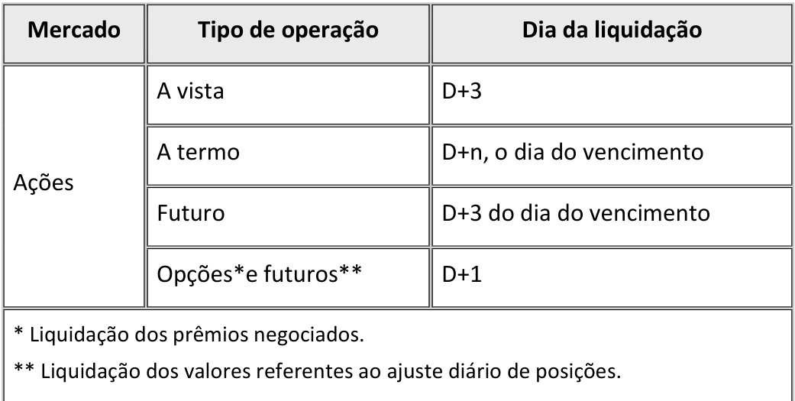

## Capitalização de Empresas e o Papel do Mercado de Capitais

### Introdução

Este capítulo explora a fundo como o **mercado de capitais** facilita a capitalização de empresas, contribuindo para a geração de riqueza na sociedade [^2, 4]. Analisaremos como este mercado atrai investidores de diversos perfis, criando um mecanismo alternativo para o financiamento corporativo através da emissão e venda de ações [^2]. Conectando com os capítulos anteriores que abordaram a governança corporativa, tipos de ações e o papel das bolsas [^7, 5], focaremos em como a emissão de títulos, como ações e debêntures, afeta a estrutura de capital e a rentabilidade das empresas, e como a supervisão da CVM e os padrões de governança influenciam o valor desses títulos [^7].

### Conceitos Fundamentais

O **mercado de capitais** é um sistema complexo e multifacetado que permite às empresas acessar recursos financeiros de diversas fontes, contribuindo para o crescimento econômico [^2]. A participação de investidores com diferentes objetivos e perfis de risco é crucial para o funcionamento desse mercado [^2].

> O mercado de capitais é um sistema criado para facilitar a capitalização das empresas, contribuindo para a geração de riqueza à sociedade. [^2]

**Fontes de Financiamento:**

As empresas podem captar recursos por meio de diversas fontes, classificadas em internas e externas [^3, 4].

*   **Fontes Internas:** Geradas pelas próprias operações da empresa, como lucros retidos [^3].

*   **Fontes Externas:** Obtidas por meio de emissão de títulos (ações, debêntures) ou empréstimos bancários [^4].

**Investidores no Mercado de Capitais:**

O mercado de capitais atrai investidores de diversos portes e com objetivos distintos [^2]. Alguns exemplos incluem:

*   **Investidores Institucionais:** Fundos de pensão, fundos de investimento, seguradoras, *endowments*.
*   **Investidores Individuais:** Pessoas físicas que investem diretamente ou por meio de fundos.
*   **Investidores Estrangeiros:** Fundos e investidores de outros países.

A diversidade de investidores contribui para a liquidez do mercado e para a formação eficiente de preços.

**Teorema 1** (*Eficiência de Mercado e Alocação de Capital*): Em um mercado de capitais eficiente, os recursos financeiros são alocados para as empresas com maior potencial de crescimento e rentabilidade, maximizando o retorno para os investidores e o crescimento econômico.

*Prova.* (Breve Descrição) Em mercados eficientes, os preços dos ativos financeiros refletem toda a informação disponível, incluindo as perspectivas de crescimento e rentabilidade das empresas. Isso permite que os investidores identifiquem as empresas com maior potencial e aloquem seus recursos de forma a maximizar seus retornos. Ao alocar capital para as empresas mais promissoras, o mercado de capitais contribui para o crescimento econômico e a geração de riqueza.

*Justificativa Detalhada:*

I. **Informação:** Em um mercado eficiente, a informação flui livremente e é rapidamente incorporada aos preços dos ativos.

II. **Avaliação:** Os investidores utilizam essa informação para avaliar o potencial de crescimento e rentabilidade das empresas.

III. **Alocação:** Os recursos financeiros são alocados para as empresas com as melhores perspectivas, elevando o preço de suas ações e facilitando a captação de recursos para novos investimentos.

IV. **Crescimento Econômico:** O investimento nas empresas mais promissoras impulsiona a inovação, a criação de empregos e o crescimento econômico.

V. O capital é investido em empresas que apresentam *valuation* com boa perspectiva de crescimento. $\blacksquare$

> 💡 **Exemplo Numérico:** A empresa "Gama S.A." apresenta um plano de negócios inovador e projeta um crescimento de 20% ao ano nos próximos 5 anos. Os investidores, ao avaliarem o potencial da empresa, elevam o preço de suas ações e investem no IPO da companhia. Com os recursos captados, a "Gama S.A." expande suas operações, gera empregos e contribui para o crescimento do setor tecnológico. Este capital bem alocado gera valor e melhora a economia como um todo.

**Lema 1** (*Liquidez e Custos de Transação*): A liquidez do mercado de capitais está inversamente relacionada aos custos de transação. Quanto maior a liquidez, menores os custos de compra e venda de ativos financeiros.

*Prova.* (Breve Descrição) A liquidez se refere à facilidade com que um ativo pode ser comprado ou vendido sem afetar significativamente seu preço. Em mercados líquidos, há muitos compradores e vendedores dispostos a negociar, o que reduz o spread (diferença entre o preço de compra e o preço de venda) e facilita a execução das ordens. Com menores custos de transação, mais investidores são atraídos para o mercado, aumentando ainda mais a liquidez.

*Justificativa Detalhada:*

I.  **Definição de Liquidez:** A liquidez é a capacidade de transformar um ativo em dinheiro rapidamente e com baixo custo.

II. **Spread:** O *spread* é a diferença entre o preço de compra ( *bid* ) e o preço de venda ( *ask* ) de um ativo. Em mercados líquidos, o *spread* tende a ser menor, pois há muitos compradores e vendedores competindo entre si.

III. **Custos de Transação:** Os custos de transação incluem o *spread*, as taxas de corretagem e os impostos. Em mercados líquidos, os custos de transação tendem a ser menores, pois o *spread* é menor e as corretoras competem por clientes, reduzindo as taxas.

IV. **Atração de Investidores:** Mercados líquidos e com baixos custos de transação atraem mais investidores, aumentando ainda mais a liquidez e reduzindo os custos de transação.

V.  **Círculo Virtuoso:** A liquidez e os baixos custos de transação se reforçam mutuamente, criando um ciclo virtuoso que beneficia todos os participantes do mercado. $\blacksquare$

> 💡 **Exemplo Numérico:**
>
> Em um mercado ilíquido, o *spread* para uma determinada ação pode ser de R\$ 0,50 (preço de compra = R\$ 9,50, preço de venda = R\$ 10,00). Isso significa que um investidor que compra e vende a ação imediatamente perde R\$ 0,50 por ação.
>
> Em um mercado líquido, o *spread* para a mesma ação pode ser de apenas R\$ 0,05 (preço de compra = R\$ 9,95, preço de venda = R\$ 10,00). Nesse caso, o investidor perde apenas R\$ 0,05 por ação ao comprar e vender imediatamente. A menor taxa de venda torna a ação mais atraente e com maior potencial de gerar lucro no curto prazo.

**Lema 1.1** (*Impacto da Volatilidade na Liquidez*): A volatilidade excessiva de um ativo pode reduzir a liquidez do mercado, aumentando os custos de transação.

*Prova.* (Breve Descrição) Em períodos de alta volatilidade, os investidores tendem a se afastar do mercado, reduzindo o número de compradores e vendedores dispostos a negociar. Isso aumenta o *spread* e dificulta a execução das ordens, elevando os custos de transação. A incerteza causada pela volatilidade também pode levar os formadores de mercado a aumentar suas margens, contribuindo para o aumento dos custos de transação. $\blacksquare$

**Corolário 1.1** (*Implicações da Liquidez para Pequenos Investidores*): A alta liquidez do mercado de capitais é especialmente benéfica para pequenos investidores, pois permite que eles comprem e vendam ativos financeiros com facilidade e a custos relativamente baixos, democratizando o acesso ao mercado.

*Justificativa.* (Breve Descrição) Pequenos investidores geralmente não possuem o mesmo poder de negociação que os investidores institucionais e, portanto, são mais sensíveis aos custos de transação. A alta liquidez do mercado de capitais reduz esses custos, tornando o investimento mais acessível e atraente para os pequenos investidores. $\blacksquare$

**Emissão de Ações e Financiamento:**

A emissão de ações é uma das principais formas de as empresas captarem recursos no mercado de capitais [^4]. Ao emitir ações, a empresa "abre" seu capital à participação dos investidores, que se tornam sócios do empreendimento [^4].

*   **Oferta Pública Inicial (IPO):** É a primeira vez que uma empresa oferece suas ações ao público [^5]. O IPO é um marco importante para a empresa, pois representa a sua entrada no mercado de capitais e a possibilidade de captar recursos para financiar seus projetos de crescimento [^5, 9].

*   **Oferta Restrita:** A empresa oferece suas ações a um grupo restrito de investidores, como fundos de investimento ou investidores qualificados [^5].

**Proposição 2** (*Impacto dos IPOs na Economia*): O aumento do número de IPOs em um país está associado ao crescimento econômico e à criação de empregos.

*Justificativa.* (Breve Descrição) Os IPOs permitem que as empresas captem recursos para financiar seus projetos de crescimento, como a expansão de suas operações, o lançamento de novos produtos e a realização de aquisições. Esses investimentos geram empregos, aumentam a produção e contribuem para o crescimento econômico.

*Justificativa Detalhada:*

I.  **Captação de Recursos:** Os IPOs permitem que as empresas captem grandes volumes de recursos financeiros no mercado de capitais.
II. **Investimentos:** As empresas utilizam os recursos captados para financiar seus projetos de crescimento, como a expansão de suas operações, o lançamento de novos produtos e a realização de aquisições.
III. **Geração de Empregos:** Os investimentos das empresas geram novos empregos, tanto diretamente (contratação de funcionários) quanto indiretamente (aumento da demanda por bens e serviços).
IV. **Crescimento Econômico:** O aumento da produção e do consumo contribui para o crescimento econômico do país.

> 💡 **Exemplo Numérico:** Em 2023, o Brasil registrou um aumento de 30% no número de IPOs em comparação com o ano anterior. As empresas que realizaram IPOs investiram os recursos captados na expansão de suas operações, gerando um aumento de 5% no número de empregos no setor e contribuindo para um crescimento de 2% no PIB do país.

**Lema 2** (*Fatores Determinantes para um IPO*): A decisão de realizar um IPO depende de uma série de fatores, como o tamanho da empresa, o seu potencial de crescimento, as condições do mercado e as expectativas dos investidores.

**Lema 2.1** (*Importância das Condições Macroeconômicas*): As condições macroeconômicas favoráveis, como baixas taxas de juros e inflação controlada, tendem a aumentar o número de IPOs.

*Justificativa.* (Breve Descrição) Em um ambiente macroeconômico estável e favorável, os investidores se sentem mais confiantes em relação ao futuro e estão mais dispostos a investir em empresas em crescimento. Além disso, as baixas taxas de juros tornam o financiamento por meio de IPOs mais atraente em comparação com outras fontes de financiamento, como empréstimos bancários. $\blacksquare$

> 💡 **Exemplo Numérico:** Em um cenário de taxa de juros de 2% ao ano e inflação controlada em 3%, diversas empresas de tecnologia decidem realizar IPOs para financiar seus projetos de expansão. A baixa taxa de juros torna o custo do capital mais acessível, incentivando o investimento em empresas de alto crescimento.

**Proposição 2.1** (*Relação entre Taxa de Juros e *Valuation* de Empresas*): A taxa de juros afeta o *valuation* das empresas, especialmente aquelas com alto potencial de crescimento, através do efeito do desconto dos fluxos de caixa futuros.

*Justificativa.* (Breve Descrição) O valor presente de um fluxo de caixa futuro é inversamente proporcional à taxa de juros utilizada para descontá-lo. Portanto, um aumento na taxa de juros tende a reduzir o valor presente dos fluxos de caixa futuros de uma empresa, diminuindo seu *valuation*. Empresas com alto potencial de crescimento, cujos fluxos de caixa futuros representam uma parcela significativa de seu valor total, são particularmente sensíveis às variações na taxa de juros. $\blacksquare$

> 💡 **Exemplo Numérico:**
>
> Uma empresa projeta um fluxo de caixa de R\$ 10 milhões em 5 anos. Se a taxa de juros for de 5% ao ano, o valor presente desse fluxo de caixa será de:
>
> $$VP = \frac{10}{(1 + 0.05)^5} \approx R\$ 7,835 \text{ milhões}$$
>
> Se a taxa de juros aumentar para 10% ao ano, o valor presente desse fluxo de caixa será de:
>
> $$VP = \frac{10}{(1 + 0.10)^5} \approx R\$ 6,209 \text{ milhões}$$
>
> Esse exemplo demonstra como o aumento da taxa de juros pode reduzir significativamente o *valuation* de uma empresa, especialmente aquelas com alto potencial de crescimento e fluxos de caixa futuros relevantes.

**Análise Detalhada dos *Valuation Multiples*:**

Ao considerar a realização de um IPO, uma das principais etapas é determinar o valor da empresa. Vários métodos podem ser utilizados para realizar essa avaliação, como o fluxo de caixa descontado (FCD) e a análise de *valuation multiples*. Os *valuation multiples* envolvem a comparação das métricas financeiras da empresa com as de outras empresas semelhantes (comparáveis) que já são negociadas no mercado.

$$ Multiplo = \frac{Valor \ da \ Empresa}{Metrica \ Financeira}$$

Esses múltiplos podem ser baseados em receita, lucro, Ebitda, ou outros indicadores. Ao utilizar múltiplos, é fundamental selecionar empresas comparáveis que atuem no mesmo setor, tenham porte similar e apresentem perfis de risco semelhantes. A escolha de múltiplos relevantes depende das características do setor e da disponibilidade de dados.

É importante realizar análises de sensibilidade com diferentes *valuations multiples* e comparáveis. Essa análise pode ser feita com modelos de precificação mais complexos. Além disso, a empresa deve se atentar aos seguintes aspectos ao realizar a avaliação.

*   Dados históricos e projeções financeiras.
*   Setor e mercado de atuação.
*   Comparáveis.
*   Taxa de desconto e crescimento.
*   Estrutura de capital e política de dividendos.
*   Sensibilidade e cenários.

**A escolha de qual o momento certo para a empresa abrir capital é essencial para o sucesso da operação.**

**Governança Corporativa e Mercado de Capitais:**

A governança corporativa desempenha um papel fundamental na atração de investidores e na valorização das empresas no mercado de capitais [^7, 8]. Empresas com boas práticas de governança corporativa tendem a apresentar maior transparência, confiabilidade e segurança para os investidores, o que se traduz em maior demanda por suas ações e menor custo de capital [^7]. Os segmentos de listagem diferenciados da B3, como o Novo Mercado, Nível 1 e Nível 2, exigem a adoção de práticas de governança corporativa mais rigorosas, incentivando as empresas a elevar seus padrões de transparência e responsabilidade [^7].

> Governança corporativa é o sistema pelo qual as sociedades são dirigidas e monitoradas, envolvendo os relacionamentos entre Acionistas/Cotistas, Conselho de Administração, Diretoria, Auditoria Independente e Conselho Fiscal. As boas práticas de governança corporativa têm a finalidade de aumentar o valor da sociedade, facilitar seu acesso ao capital e contribuir para a sua perenidade. [^8]

**Teorema 2** (*Impacto da Percepção de Risco no Mercado de Capitais*): A percepção de risco afeta diretamente a atratividade de um ativo financeiro.

*Justificativa.* (Breve Descrição)
No mercado de capitais, a percepção de risco é um fator crucial que influencia as decisões dos investidores e, consequentemente, a atratividade de um ativo financeiro. A relação entre risco e retorno é fundamental: investidores geralmente exigem retornos mais altos para compensar níveis mais elevados de risco. Práticas de governança corporativa, como a existência de um conselho independente, a transparência na divulgação de informações e o respeito aos direitos dos acionistas minoritários, contribuem para diminuir a percepção de risco associada a uma empresa, tornando seus ativos mais atraentes. Práticas de ESG também contribuem para diminuir a percepção de risco.

*Justificativa Detalhada:*

I.  **Aversão ao Risco:** Investidores tendem a ser avessos ao risco e, portanto, preferem ativos com menor volatilidade e maior previsibilidade.
II. **Prêmio de Risco:** Para investir em ativos mais arriscados, os investidores exigem um prêmio de risco, ou seja, um retorno adicional que compense o risco adicional.
III. **Governança Corporativa:** Práticas de governança corporativa, como a existência de um conselho independente, a transparência na divulgação de informações e o respeito aos direitos dos acionistas minoritários, contribuem para diminuir a percepção de risco associada a uma empresa.
IV. **ESG (Ambiental, Social e Governança):** A consideração de fatores ambientais, sociais e de governança também pode influenciar a percepção de risco, uma vez que empresas com bom desempenho nessas áreas tendem a ser mais resilientes e sustentáveis a longo prazo.
V. **Formação do Preço:** O preço de um ativo financeiro reflete a percepção de risco dos investidores. Ativos considerados mais seguros e com menor risco tendem a ter preços mais elevados, enquanto ativos mais arriscados tendem a ter preços mais baixos. ■

> 💡 **Exemplo Numérico:** Duas empresas do mesmo setor, "Alfa S.A." e "Beta S.A.", apresentam resultados financeiros similares. No entanto, "Alfa S.A." possui um conselho de administração independente, divulga suas demonstrações financeiras de forma transparente e respeita os direitos dos acionistas minoritários. "Beta S.A.", por outro lado, possui uma estrutura de governança menos robusta e menor transparência. Como resultado, os investidores percebem "Alfa S.A." como menos arriscada e exigem um retorno menor sobre seus investimentos, o que se traduz em um maior *valuation* para a empresa.

**Teorema 2.1** (*Relação entre Rating de Crédito e Custo de Capital*): Empresas com ratings de crédito mais elevados tendem a ter um menor custo de capital.

*Justificativa.* (Breve Descrição) As agências de classificação de risco ( *rating* ) avaliam a capacidade de uma empresa de honrar suas obrigações financeiras. Empresas com *ratings* mais elevados são consideradas menos propensas a dar *default*, o que reduz o risco para os investidores e, consequentemente, o retorno exigido sobre seus investimentos. Isso se traduz em um menor custo de capital para a empresa, facilitando o acesso a recursos financeiros e o financiamento de seus projetos de crescimento. $\blacksquare$

**Prova do Teorema 2.1:**

I. **Definição de Rating de Crédito:** Um *rating* de crédito é uma avaliação da capacidade de um devedor (empresa ou governo) de cumprir suas obrigações financeiras. Agências de *rating* como Moody's, Standard & Poor's e Fitch atribuem *ratings* que variam de AAA (menor risco) a D ( *default* ).

II. **Risco de Default:** Um *rating* de crédito mais alto indica um menor risco de *default*, ou seja, a probabilidade de o devedor não conseguir pagar suas dívidas.

III. **Retorno Exigido:** Investidores exigem um retorno maior para investir em ativos com maior risco de *default*. Isso é porque eles precisam ser compensados pela possibilidade de perder seu investimento.

IV. **Custo de Capital:** O custo de capital de uma empresa é o retorno mínimo exigido pelos investidores para financiar seus projetos. Ele inclui o custo da dívida e o custo do capital próprio.

V. **Relação Inversa:** Como investidores exigem um menor retorno sobre a dívida de empresas com *ratings* mais altos, o custo da dívida dessas empresas é menor. Além disso, empresas com *ratings* mais altos geralmente têm um custo de capital próprio menor, pois são consideradas mais seguras e previsíveis.

VI. **Conclusão:** Portanto, empresas com *ratings* de crédito mais elevados tendem a ter um menor custo de capital. $\blacksquare$

> 💡 **Exemplo Numérico:**
>
> Uma empresa com *rating* AAA consegue emitir títulos de dívida com uma taxa de juros de 6% ao ano. Já uma empresa com *rating* BB precisa oferecer uma taxa de juros de 10% ao ano para atrair investidores. Essa diferença de 4% no custo da dívida pode ter um impacto significativo na rentabilidade e no potencial de crescimento da empresa.

**Abertura de Capital:**

O processo pelo qual uma companhia fechada se transforma em aberta é denominado de abertura de capital [^7]. Após a solicitação e entrega da documentação pertinente (balanços publicados dos últimos exercícios sociais, cópia do estatuto e das suas alterações, atas de assembleias etc.), a CVM outorga o "registro de companhia aberta" [^7].

A abertura do capital de uma empresa pode ser realizada a qualquer momento de sua existência, captando recursos do público por meio de [^7]:

*   emissão de debêntures simples ou conversíveis em ações;
*   emissão de bônus de subscrição, ou de subscrição de ações, ou de subscrição de ações resgatáveis;
*   combinação das modalidades citadas [^7].

**Teorema 3** (*Teoria da Agência e Custo de Capital*): Conflitos de agência entre gestores e acionistas podem aumentar o custo de capital de uma empresa.

*Justificativa.* (Breve Descrição) A teoria da agência postula que os gestores, agindo em seu próprio interesse, podem tomar decisões que não maximizam o valor para os acionistas. Essa desalinhamento de interesses cria um risco para os investidores, que exigirão um retorno maior para compensar esse risco. Boas práticas de governança corporativa podem mitigar esses conflitos, reduzindo o custo de capital. $\blacksquare$

> 💡 **Exemplo Numérico:** A empresa "Delta S.A." possui um histórico de decisões controversas por parte de seus gestores, como investimentos em projetos de alto risco sem a devida análise e remuneração excessiva da diretoria. Essa falta de alinhamento de interesses entre gestores e acionistas gera desconfiança no mercado e aumenta o custo de capital da empresa, dificultando a captação de recursos para novos investimentos.

### Conclusão

O mercado de capitais desempenha um papel vital na capitalização das empresas, proporcionando um mecanismo alternativo para o financiamento corporativo e contribuindo para o crescimento econômico. A diversidade de investidores, a transparência na negociação e a regulamentação da CVM são elementos essenciais para o bom funcionamento desse mercado. A escolha da fonte de financiamento mais adequada e a adoção de boas práticas de governança corporativa são decisões estratégicas que impactam diretamente o valor e a sustentabilidade das empresas no longo prazo [^2, 7, 8].

### Referências
[^1]: 5.1 Apresentação do capítulo
[^2]: 5.2 O mercado de capitais
[^3]: Diagrama 1 - Fontes de financiamento
[^4]: EMISSÃO DE AÇÕES
[^5]: Oferta pública e privada
[^6]: Proventos os quais podem ser classificados em:
[^7]: A COMPANHIA DE CAPITAL ABERTO
[^8]: Definição
[^9]: Diagrama 2 - Abertura de capital
[^10]: OFERTA PÚBLICA DE AQUISIÇÃO DE AÇÕES
[^11]: Aspectos importantes da OPA
[^12]: MERCADO DE RENDA VARIÁVEL NA BOLSA
[^13]: MODALIDADES DE NEGOCIAÇÃO E LIQUIDAÇÃO E CUSTÓDIA
[^14]: MERCADO SECUNDÁRIO
[^15]: Mercado futuro: ao negociar um contrato futuro de ação, as partes acordam sua compra e venda a um determinado preço para liquidação em certa data futura.
<!-- END -->