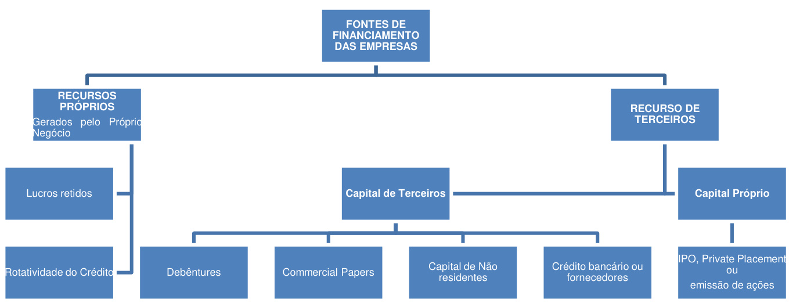

## Figure1

A imagem apresenta um fluxograma simplificado do processo de abertura de capital de uma empresa, conforme descrito na seção 5.2 do documento. O fluxograma é composto por quatro etapas sequenciais, representadas por setas indicando a progressão do processo: "Decisão dos acionistas", "Aprovação legal CVM", "Colocação primária underwriting" e "Oferta em bolsas de valores". Cada etapa representa um marco importante no processo de IPO (Initial Public Offering), desde a deliberação interna até a negociação das ações no mercado.

## Figure2

O diagrama ilustra as fontes de financiamento para empresas, classificando-as em recursos próprios (gerados pelo próprio negócio, como lucros retidos e rotatividade do crédito), capital de terceiros (incluindo debêntures, commercial papers, capital de não residentes, e crédito bancário ou fornecedores), e recurso de terceiros, que incluem capital próprio como IPO, Private Placement, ou emissão de ações. Ele fornece uma visão geral estruturada das diferentes opções de financiamento disponíveis para as empresas, conforme mencionado na página 3 do documento.

## Figure3

A imagem apresenta uma tabela que descreve os prazos de liquidação para diferentes tipos de operações no mercado de ações, conforme definido pela CBLC (Companhia Brasileira de Liquidação e Custódia). A tabela divide as operações por 'Mercado', 'Tipo de Operação' (à vista, a termo, futuro, opções e futuros) e 'Dia da Liquidação' (D+3, D+n, D+3 do dia do vencimento, D+1), indicando o número de dias úteis após a data da negociação em que a liquidação financeira é realizada. As notas de rodapé explicam a liquidação de prêmios negociados e os valores referentes ao ajuste diário de posições.
